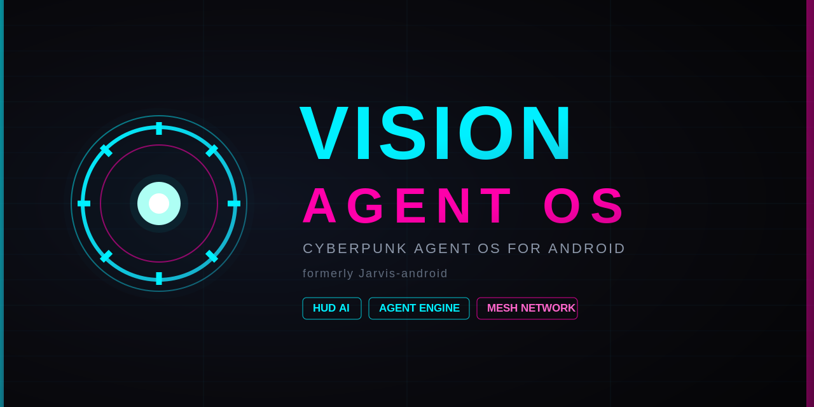

<div align="center">

# ⚡ Vision OS
### Sovereign Intelligence Edition · v16.0 · formerly Jarvis-android



**A sovereign Personal Intelligence Operating Layer — it lives with you and gets smarter every day**  
*یک لایه‌ی هوش شخصی حاکمیتی — که با تو زندگی می‌کند و هر روز باهوش‌تر می‌شود*

[-red.svg?style=for-the-badge)](LICENSE)
[](ROADMAP.md)
[](https://www.android.com/)
[](ROADMAP.md)
[](docs/ACTIVATION.md)
[-cyan?style=for-the-badge)](CONTRIBUTING.md)

</div>

---

> ⚠️ **This is NOT open source.** The code is *source-available* for transparency and collaboration only. Commercial use, redistribution, and derivative works are prohibited — see [LICENSE](LICENSE).
>
> ⚠️ *این پروژه اوپن‌سورس نیست. کد فقط برای شفافیت و مشارکت قابل‌مشاهده است؛ استفاده‌ی تجاری/بازانتشار/اثر مشتق ممنوع.*

> 🤖 Designed and built with the assistance of **Claude AI (Anthropic)**.

---


## 📊 Status — what's actually built (updated 2026-06-11)

| Area | Status | Where |
|---|---|---|
| Brain-Lite server (10 REST endpoints, Ktor on :7799) | ✅ DONE | `app/src/main/java/com/kianirani/jarvis/brain/server/` |
| Room DB (memories / nodes / tasks) + repositories | ✅ DONE | `app/.../brain/data/` |
| Brain Score election + auto-failover | ✅ DONE | `app/.../brain/score/` |
| Election UI on live node registry (90s freshness) | ✅ DONE | `app/.../ui/screen/election/` |
| Heartbeats (stable id, 30s client sender) | ✅ DONE | `app/.../brain/data/HeartbeatSender.kt` |
| Brain Discovery: `vision://join` payload + mDNS advertise/scan | ✅ DONE | `app/.../brain/discovery/` |
| Setup Wizard: live candidates list + real /health handshake | ✅ DONE | `app/.../ui/screen/setup/` |
| Pairing persistence (Keystore-encrypted) | ✅ DONE | `BrainSelectionStore.kt` |
| QR pairing core (zxing generate, round-trip tested) | ✅ DONE | `QrPairing.kt` |
| QR screens (render + CameraX scanner) | 🔜 next | — |
| Brain-Full (Python FastAPI: health probes, JSON logging, CI) | ✅ M0 DONE | `brain/` |
| Temporal workflow engine (replaces n8n) | ✅ DONE | `docker-compose.yml` |

> **Where is the Android code?** In [`/app`](app) (`com.kianirani.jarvis`). The `android/` folder is only a pointer/module map. Full plan: [ROADMAP.md](ROADMAP.md).


## What is Vision?

**Vision is NOT a launcher. NOT a chatbot. NOT a single agent.**

**Vision is a Personal Intelligence Operating Layer** — a sovereign layer that runs on the user's *own*
hardware, unifies all devices, data, and AI capabilities into one ecosystem, and gets smarter every day.

You don't operate tools. You talk to Vision, and Vision does the rest.

*ویژن یک لانچر، چت‌بات یا agent منفرد نیست — یک لایه‌ی عاملِ هوش شخصی حاکمیتی است که روی سخت‌افزار خودِ کاربر اجرا می‌شود و هر روز باهوش‌تر می‌شود.*

```
        ┌──────────────────────────────────────────────┐
        │                  V I S I O N                  │
        │      Personal Intelligence Operating Layer    │
        └──────────────────────────────────────────────┘
                 │            │            │
            ┌────┴───┐   ┌────┴────┐  ┌────┴────┐
            │ Phone  │   │  VPS/PC │  │  Mesh   │   ← every device is a potential Brain
            │ Brain  │   │  Brain  │  │  Nodes  │
            └────────┘   └─────────┘  └─────────┘
```

> **Core principle — Distributed Brain:** every device can run Vision on its own. When a new device joins
> the Mesh, its resources (CPU/RAM/GPU) are added to the Brain with user consent, making Vision faster and
> smarter. Any node can go offline without taking the system down.

> **In one line:** Vision = Iron Man HUD + Claude Code + Server Manager + Distributed Brain — on your own hardware, offline, with any model.

---

## 🌍 Competitive Edge

| Feature | Microsoft Solara | Google Gemini OS | **Vision v16.0** |
|---------|:---:|:---:|:---:|
| Hardware required | new Badge/Desk | dedicated Android XR | ✅ **any existing device** |
| Full offline | ❌ | ❌ | ✅ **Local-First** |
| AI providers | Azure only | Google only | ✅ **unlimited** |
| Monthly cost | Enterprise | $100 | ✅ **$3** |
| Privacy | Cloud | Gmail/Calendar access | ✅ **Zero-Knowledge Local** |
| Brain on every device | ❌ | ❌ | ✅ **Phone/VPS/PC** |
| Distributed compute | ❌ | ❌ | ✅ **Mesh CPU/GPU** |
| Every world language | limited | limited | ✅ **Universal** |

---

## 🔑 Activation

Vision is an **activation-based** product. The user receives an **activation token** from the official bot:

```
User → «kiancdn» Telegram bot → receive token → enter in app → activated
```

- 🤖 Activation bot: **[@kian_irani_cdn_f](https://t.me/kian_irani_cdn_f)** (kiancdn)
- 💳 Plan: **$3/month** or **$30/year** · 14-day full trial, no card
- 📄 Full flow, token security & architecture: **[docs/ACTIVATION.md](docs/ACTIVATION.md)**

> Tokens are personal, revocable and rate-limited. Sharing or bypassing activation violates the license.
> *توکن‌ها شخصی، قابل‌ابطال و دارای محدودیت نرخ‌اند.*

---

## ✨ Core Features (v16)

| Area | Capabilities |
|------|--------------|
| 🧠 **Distributed Brain** | Three tiers (Brain-Nano / Lite / Full), auto-election via **Brain Score**, Auto-Failover, full phone operation without a VPS |
| 🔀 **Multi-Token AI Router** | Unlimited providers (Claude · Gemini · Groq · OpenAI · Grok · OpenRouter · Ollama), < 100 ms switch, Fallback Chain, Cost Dashboard |
| ⚡ **VISN Protocol** | Ultra-fast file transfer between nodes (smart LZ4/zstd, chunked, resumable, ≥3× faster) |
| 🤖 **Agentic Core** | ReAct + LangGraph, Plan DAG, Self-Correction, Agent Pool (Browser/File/Code/Research…), natural-language **Vision Scheduler** |
| 🔒 **Trust Level System** | Read / Suggest / Auto / Critical — per-agent trust, tamper-evident Audit Trail |
| 🧪 **Vision Lab** | Dry-run any workflow with mock data before real execution + Chain Visualizer |
| 🔍 **AnySearch + Timeline + Notes** | Semantic search across all devices, local digital timeline, smart notes wired to Memory |
| 🎙️ **Voice & Persona** | Custom wake word, Persian STT/TTS + Persona sliders, emotion & context detection |
| 🌐 **Universal Language** | True support for **every language** (3-tier: full Persian → 9 full languages → universal fallback) |
| 🎨 **Cyberpunk HUD** | Arc Reactor, Glassmorphism (Haze 2.0), AGSL shaders, audio-reactive, < 5% CPU @ 60fps |
| 🛡️ **Zero-Trust Security** | Secret Vault (Keystore + biometrics), Behavioral Baseline, active **Privacy Threat Monitor** |
| 🤝 **Mesh & Handoff** | Cross-device Session Handoff, Universal Clipboard, Distributed Compute Mesh |

Full 20+ phases: **[ROADMAP.md](ROADMAP.md)** · architecture: **[docs/ARCHITECTURE.md](docs/ARCHITECTURE.md)**

---

## 🏗️ Architecture

```
┌────────────────────────────────────────────────────────────────┐
│                          V I S I O N   O S                       │
├───────────────┬───────────────┬───────────────┬────────────────┤
│   HUD Layer   │   AI Core      │  Agent Engine │  Mesh Network  │
│  Cyberpunk    │  Multi-Token   │  ReAct+Trust  │  Distributed   │
│  Compose/AGSL │  Router        │  Vision Lab   │  Brain + VISN  │
├───────────────┴───────────────┴───────────────┴────────────────┤
│   Distributed Brain  ·  Brain-Nano / Lite / Full  ·  Score      │
├──────────────────────────────────────────────────────────────── ┤
│   Universal Language · AnySearch · Timeline · Notes · Memory    │
├──────────────────────────────────────────────────────────────── ┤
│   Activation & Licensing (kiancdn)  ·  Zero-Trust Security      │
└────────────────────────────────────────────────────────────────┘
```

**Tech Stack v16**
```
Android   : Kotlin 2.0 + Jetpack Compose + Haze 2.0 + AGSL · Clean Arch + MVI · Hilt
Brain     : Python 3.12 + FastAPI + LangGraph · Hexagonal (Ports & Adapters)
Workflow  : Temporal Workflow Engine  (replaces n8n)
Transfer  : VISN Protocol — LZ4 + zstd + XXH3, chunked/resumable
Data      : Room/SQLite (Lite) · PostgreSQL + Redis + ChromaDB (Full) · CRDT sync
Voice     : Vosk / faster-whisper (STT) + Coqui XTTS v2 / Piper (TTS)
Security  : Android Keystore + EncryptedDataStore · Behavioral Baseline
Quality   : Detekt/ktlint · Ruff/mypy · pytest · GitHub Actions CI/CD · OpenTelemetry
```

See the full target tree in **[ROADMAP.md](ROADMAP.md)** and module map in [`android/MODULES.md`](android/MODULES.md) · [`brain/MODULES.md`](brain/MODULES.md).

---

## 🗺️ Phase Map (v16)

| Band | Phases | Focus |
|------|--------|-------|
| 🔴 Foundation | PX · P0 · P1 · P1.5 · P2 | Code Standards, Foundation Fix, Flexible Brain, VISN, Router |
| 🟠 Product | P3 · P4 · P4.5 · P5 · P5.5 · P6 · P7 · P7.5 | Launcher MVP, Licensing, Trust, Agentic, Lab, Search/Notes, Voice/Language, Capture/A11y |
| 🟡 Network | P8 → P12 | Device Mesh, Offline, Memory/RAG, OS-Integration, MCP & Plugins |
| 🔴 Security | P13 | Zero-Trust + Behavioral Baseline + Privacy Monitor |
| 🟢 Horizon | P14 → P20 | Communication, Health, IoT, Marketplace, Full Vision OS |

**Beta milestone:** end of Phase 7 (week 20) · **M0 Foundation Ready:** day 7

---

## 🚀 Getting Started

This repository is **source code**, not a public APK download. For real use:

1. Go to **[@kian_irani_cdn_f](https://t.me/kian_irani_cdn_f)** and get an activation token.
2. Get the official Vision build via the same bot/channel.
3. Open the app → enter the token → activate.

> **Developers:** to build from source and run the Brain Server, see [CONTRIBUTING.md](CONTRIBUTING.md) and [docs/SETUP.md](docs/SETUP.md). Building from source is permitted only for contribution under the [CLA](CLA.md).

---

## 🤝 Call for Contributors

We're looking for serious developers. Contributions are under the **[CLA](CLA.md)** (the code stays source-available, not open source).

| Area | Skills | Priority |
|------|--------|----------|
| 🧠 Brain Core | Python + FastAPI + LangGraph | 🔴 urgent |
| 🔀 AI Router | Python + LiteLLM | 🔴 urgent |
| 🎨 HUD/UI | Kotlin + Compose + AGSL | 🔴 urgent |
| ⚡ VISN Transfer | Kotlin + Python (LZ4/zstd) | 🟠 high |
| 🔒 Security | Android Security + Crypto | 🟠 high |
| 🎙️ Voice/Language | Vosk + Whisper + Coqui | 🟠 high |

👉 Full guide: **[CONTRIBUTING.md](CONTRIBUTING.md)** · contact: [@Kian_irani_t](https://t.me/Kian_irani_t)

---

## 📚 Documentation

| File | Content |
|------|---------|
| [ROADMAP.md](ROADMAP.md) | Full v16 roadmap — 20+ phases, milestones, ADRs |
| [docs/ARCHITECTURE.md](docs/ARCHITECTURE.md) | Technical architecture |
| [docs/ACTIVATION.md](docs/ACTIVATION.md) | Activation flow & kiancdn token service |
| [docs/SETUP.md](docs/SETUP.md) | Development setup |
| [docs/adr/](docs/adr/) | Architecture Decision Records (ADR-001…011) |
| [CONTRIBUTING.md](CONTRIBUTING.md) · [CLA.md](CLA.md) | Contribution |
| [SECURITY.md](SECURITY.md) | Vulnerability reporting |
| [LICENSE](LICENSE) | Source-available proprietary license |

---

## 📄 License

**Vision OS Source-Available License (VAOS-SAL) v1.0** — © 2026 Kian Irani.  
Source is viewable; commercial use / redistribution / derivatives prohibited. Full text: [LICENSE](LICENSE).

---

<div align="center">

**Vision** — not just an app. **The future of human–AI interaction, on your own hardware.**

*Made with ❤️ and Neon — by Kian Irani & contributors · Built with Claude AI*

</div>
